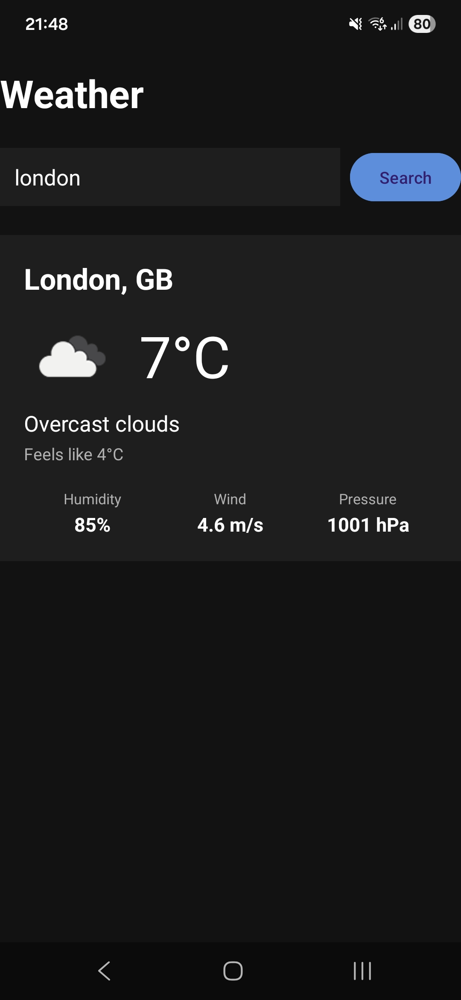

This is a simple weather app made using [**Kotlin**](https://kotlinlang.org) and the [**Android SDK**](https://developer.android.com), built with Android Studio. It fetches data from OpenWeatherMap.

# Getting Started

> **Note**: Make sure you have [Android Studio](https://developer.android.com/studio) and a JDK installed before proceeding, plus a valid API Key for [OpenWeatherMap](https://openweathermap.org/api).

## Step 1: Add your API key

Create or open `local.properties` in the project root and add:

```properties
OPEN_WEATHER_API_KEY=your_api_key_here
```

This file is gitignored — your key never lands in source control. The build pipeline injects it as a `BuildConfig` constant at compile time.

## Step 2: Open the project in Android Studio

Open Android Studio, then **File → Open** and pick the project root. Wait for Gradle sync to finish.

## Step 3: Build and run

Connect an Android device via USB or wireless ADB (or use an emulator), then hit the **Run** button (▶) in the toolbar, or use:

```sh
./gradlew installDebug
```

The app installs as `WeatherAppKotlin` on the device.

### App


# Architecture

Built with the standard modern Android stack:

- **UI**: XML layouts + Activity (View Binding, no Jetpack Compose)
- **State**: `ViewModel` + `StateFlow` with a sealed `UiState` (Idle / Loading / Success / Error)
- **Async**: Kotlin Coroutines (`viewModelScope`)
- **HTTP**: Retrofit + kotlinx.serialization
- **Image loading**: Coil
- **DI**: Manual constructor injection (no DI framework for this scope)

```
com.example.weatherapp/
├── MainActivity.kt          // View layer — observes state, renders
├── model/                   // Data classes (API DTOs + UI state)
├── network/                 // Retrofit interface + client
├── repository/              // Data-access seam
└── viewmodel/               // Presentation logic + observable state
```
# Learn More

- [Kotlin docs](https://kotlinlang.org/docs/home.html)
- [Android developers](https://developer.android.com)
- [Android Architecture guide](https://developer.android.com/topic/architecture)
- [Retrofit](https://square.github.io/retrofit/)
- [kotlinx.serialization](https://github.com/Kotlin/kotlinx.serialization)
- [Coil](https://coil-kt.github.io/coil/)

<a href="https://www.flaticon.com/free-icons/weather-app" title="weather app icons">Weather app icons created by Edi Prast - Flaticon</a>